# ERD Logical — Work Order Management PDAM

> **Status:** Final (setelah inkorporasi keputusan Q1–Q14).
>
> **Cara pakai:** ini adalah **ERD Logical** — menggambarkan entitas, relasi, dan kardinalitas **tanpa** detail tipe data kolom. ERD Physical (dengan tipe data, FK constraint, index) akan disusun terpisah oleh Nika & Geo dari gambar V1.5.
>
> **Notasi:** Mermaid ER diagram. Label relasi = kata kerja bisnis (bukan technical FK name).

---

## 1. Gambaran Besar (Overview)

```mermaid
flowchart LR
    subgraph MASTER["Master Data"]
        MJP[m_jenis_pengaduan]
        MJWO[m_jenis_workorder]
        MTWO[m_tipe_workorder]
        MJL[m_jenis_lokasi]
        MLOC[m_location]
        MS[m_status]
        MTP[m_tipe_progress]
        MA[m_action]
        MR[m_role]
        MJB[m_jabatan]
        MDEP[m_departemen]
        MKPI[m_kpi]
    end

    subgraph PEOPLE["Users & Organisasi"]
        PEG[m_pegawai]
        USR[users]
    end

    subgraph ADUAN["Pengaduan"]
        ADN[pengaduan]
    end

    subgraph WO["Work Order Core"]
        WOT[workorder]
        FT[form_template]
        WP[workorder_petugas]
        WOA[workorder_action]
        PRG[progress_workorder]
        DOK[dokumentasi_progress]
    end

    subgraph RPT["Output Resmi"]
        LAP[laporan_workorder]
    end

    MASTER --> PEOPLE
    PEOPLE --> ADUAN
    ADUAN --> WO
    WO --> RPT
```



---

## 2. ERD Detail

```mermaid
erDiagram
    %% ============================
    %% MASTER DATA
    %% ============================
    M_DEPARTEMEN ||--o{ M_PEGAWAI : "menaungi"
    M_JABATAN ||--o{ M_PEGAWAI : "posisi"
    M_ROLE ||--o{ USERS : "otorisasi"
    M_PEGAWAI ||--|| USERS : "akun_milik"

    M_JENIS_PENGADUAN ||--o{ PENGADUAN : "kategori"
    M_STATUS ||--o{ PENGADUAN : "status"
    M_DEPARTEMEN ||--o{ PENGADUAN : "ditangani_oleh"
    PENGADUAN ||--o{ PENGADUAN : "duplicate_of"

    %% ============================
    %% WORKORDER CORE
    %% ============================
    PENGADUAN ||--o{ WORKORDER : "memicu"
    M_JENIS_WORKORDER ||--o{ FORM_TEMPLATE : "skema_form"
    M_JENIS_WORKORDER ||--o{ WORKORDER : "jenis"
    M_TIPE_WORKORDER ||--o{ WORKORDER : "tipe"
    M_JENIS_LOKASI ||--o{ WORKORDER : "kategori_lokasi"
    M_LOCATION ||--o{ WORKORDER : "lokasi"
    M_STATUS ||--o{ WORKORDER : "status"
    M_DEPARTEMEN ||--o{ WORKORDER : "milik_departemen"

    USERS ||--o{ WORKORDER : "dibuat_admin"
    USERS ||--o{ WORKORDER : "assigned_manager"
    USERS ||--o{ WORKORDER : "pic_spv"
    USERS ||--o{ WORKORDER : "approved_by_manager"

    WORKORDER ||--o{ WORKORDER_PETUGAS : "anggota_tim"
    USERS ||--o{ WORKORDER_PETUGAS : "petugas"

    %% ============================
    %% PROGRESS & DOKUMENTASI
    %% ============================
    WORKORDER ||--o{ PROGRESS_WORKORDER : "dicatat"
    M_TIPE_PROGRESS ||--o{ PROGRESS_WORKORDER : "tipe"
    M_STATUS ||--o{ PROGRESS_WORKORDER : "status_progres"
    USERS ||--o{ PROGRESS_WORKORDER : "submitter"
    USERS ||--o{ PROGRESS_WORKORDER : "reviewer_spv"
    PROGRESS_WORKORDER ||--o{ DOKUMENTASI_PROGRESS : "foto"

    image.pngimage.png%% ============================
    %% AUDIT
    %% ============================
    WORKORDER ||--o{ WORKORDER_ACTION : "riwayat_aksi"
    M_ACTION ||--o{ WORKORDER_ACTION : "jenis_aksi"
    USERS ||--o{ WORKORDER_ACTION : "actor"

    %% ============================
    %% LAPORAN
    %% ============================
    WORKORDER ||--|| LAPORAN_WORKORDER : "menghasilkan"
    USERS ||--o{ LAPORAN_WORKORDER : "issued_by_spv"
    USERS ||--o{ LAPORAN_WORKORDER : "approved_by_manager"
```

---

## 3. Deskripsi Entitas

### 3.1 Master Data

| Entity | Atribut Utama | Catatan |
|--------|---------------|---------|
| **m_departemen** | id, nama | **2 row:** Operasional, Pelayanan (Q11) |
| **m_jabatan** | id, nama | Super Admin, Manager, SPV, Staff, Senior Staff, ... |
| **m_role** | id, nama | Super Admin, Manager, Employee (SPV/Staff dibedakan by jabatan) |
| **m_pegawai** | id, nama, nip, telepon, alamat, tanggal_lahir, jenis_kelamin, departemen_id, jabatan_id | 1 pegawai = 1 user |
| **users** | id, email, password, pegawai_id, role_id | Sanctum auth |
| **m_jenis_pengaduan** | id, kode, nama | AIR_KERUH, KEBOCORAN, METER, PEMAKAIAN, TDA, LAIN_LAIN |
| **m_jenis_workorder** | id, nama, deskripsi | Fixed list sesuai SOP PDAM (Q2) |
| **m_tipe_workorder** | id, nama | Normal / Lembur |
| **m_jenis_lokasi** | id, nama | Kantor / Lapangan |
| **m_location** | id, nama, latitude, longitude, radius_meter | Untuk presensi lokasi |
| **m_status** | id, **kode**, nama | TKT-03b — `kode` wajib untuk hindari magic id |
| **m_tipe_progress** | id, **kode**, nama | MULAI, PROGRESS, SELESAI, **REVISI**, **DITOLAK** (baru) |
| **m_action** | id, **kode**, nama, keterangan | PENUGASAN, FREEZE, RESUME, EXTEND, **APPROVE**, **REJECT**, **REVISI** (baru) |
| **m_kpi** | id, nama, bobot | Untuk future KPI calculation |

### 3.2 Core Transactional

#### `pengaduan`
Laporan keluhan dari pelanggan PDAM (atau permintaan internal).

| Atribut | Catatan |
|---------|---------|
| id | PK |
| external_id | ID dari API PDAM (unique, nullable) |
| nomor_pelanggan | Nomor meteran |
| nama_pelapor, kontak_pelapor, alamat | Data pelapor |
| jenis_pengaduan_id | FK → m_jenis_pengaduan |
| status_id | FK → m_status |
| departemen_id | FK → m_departemen (nullable) |
| duplicate_of_id | FK self → pengaduan (nullable) |
| deskripsi, tanggal_lapor | |
| fetched_at, raw_payload | Audit API (JSONB nullable) |

> **Relasi ke Workorder:** 1 pengaduan : N workorder (FK nullable di workorder).

#### `form_template`
Definisi skema form per jenis WO. Menggantikan tabel lama `detail_form`.

| Atribut | Catatan |
|---------|---------|
| id | PK |
| jenis_workorder_id | FK → m_jenis_workorder |
| nama_field | Slug (mis. `diameter_pipa`) |
| label | Label untuk UI (mis. "Diameter Pipa") |
| tipe_field | `text` / `number` / `date` / `boolean` / `select` / `textarea` |
| opsi | JSONB nullable (untuk tipe `select`) |
| required | boolean |
| validasi | JSONB nullable (min, max, regex) |
| urutan | integer |

#### `workorder`
Entity inti. 1 row = 1 WO. Isian form disimpan sebagai JSONB.

| Atribut | Catatan |
|---------|---------|
| id | PK |
| judul_pekerjaan | |
| pengaduan_id | FK nullable (Q7) |
| departemen_id | FK — **wajib**, untuk policy assign Manager (Q11) |
| jenis_workorder_id, tipe_workorder_id, jenis_lokasi_id | FK master |
| location_id, latitude, longitude | Lokasi target WO |
| waktu_penugasan, estimasi_durasi, unit_waktu, estimasi_selesai | Waktu |
| status_id | FK → m_status |
| created_by_user_id | Admin yang bikin WO |
| manager_id | FK users nullable — Manager yang assign SPV (Q5) |
| pic_id | FK users — SPV yang assign Staff |
| approved_by_user_id | FK users nullable — Manager yang approve final |
| approved_at | nullable |
| approval_notes | text nullable |
| **form_values** | **JSONB nullable** — hasil isian form (Q1) |
| lembur_spl_id | FK nullable (kalau tipe lembur) |
| timestamps | |

#### `workorder_petugas` (pivot)
1 WO bisa dikerjakan banyak petugas (Q3). Sudah diimplementasi di TKT-07.

| Atribut | Catatan |
|---------|---------|
| id, workorder_id, user_id | PK + FK |
| peran | nullable — "koordinator" / "anggota" |
| unique(workorder_id, user_id) | |

#### `progress_workorder`
Log eksekusi WO — 1 WO punya N progres.

| Atribut | Catatan |
|---------|---------|
| id | PK |
| workorder_id | FK |
| tipe_progress_id | FK → m_tipe_progress — MULAI/PROGRESS/SELESAI/**REVISI**/**DITOLAK** |
| status_id | FK → m_status — DRAFT/SUBMITTED/VERIFIED/**REVISI_REQUESTED**/**DITOLAK_SPV** |
| order | integer |
| hasil_pengerjaan | text nullable (narasi Staff) |
| waktu_submit | datetime nullable |
| submitted_by_user_id | FK users nullable — siapa yang submit |
| **reviewed_by_user_id** | **FK users nullable** — SPV yang review (Q12) |
| **reviewed_at** | **datetime nullable** (Q12) |
| **alasan_penolakan** | **text nullable** — wajib kalau DITOLAK/REVISI (Q12) |
| **field_to_revise** | **JSONB nullable** — daftar field yang harus direvisi (Q12 — Staff cukup lengkapi yg diminta) |

#### `dokumentasi_progress`
Foto hasil kerja per progres.

| Atribut | Catatan |
|---------|---------|
| id, progress_workorder_id, url | Cloudinary URL (fallback local) |
| **jenis** | **nullable** — `HASIL_KERJA` / `LAMPIRAN_REVISI` |

#### `workorder_action`
Audit trail event-level.

| Atribut | Catatan |
|---------|---------|
| id, workorder_id, action_id | PK + FK |
| actor_id | FK users (TKT-06) |
| keterangan | |
| waktu_mulai, estimasi_selesai, sisa_durasi_menit | Untuk FREEZE/EXTEND |

#### `laporan_workorder` **(BARU)**
Dokumen resmi hasil WO yang sudah di-approve Manager (Q13).

| Atribut | Catatan |
|---------|---------|
| id | PK |
| workorder_id | FK **UNIQUE** — 1 WO = 1 laporan |
| nomor_laporan | string UNIQUE — `LAP-WO-YYYY-NNNN` (sequence) |
| tanggal_terbit | datetime — saat Manager approve |
| ringkasan_pekerjaan | text — narasi final |
| **hasil_akhir_snapshot** | **JSONB** — copy `workorder.form_values` saat terbit |
| **petugas_snapshot** | **JSONB** — array of `{user_id, nama, nip}` saat terbit |
| catatan_spv | text nullable |
| catatan_manager | text nullable |
| **pdf_url** | string nullable — URL PDF hasil render (Q14) |
| issued_by_user_id | FK users — SPV yang finalisasi |
| approved_by_user_id | FK users — Manager yang approve |
| approved_at | datetime |
| timestamps | |

---

## 4. Business Rules Kritikal

### BR-1. Manager ↔ Departemen (Q11)
```
Manager dapat meng-assign WO HANYA JIKA:
  workorder.departemen_id == manager.pegawai.departemen_id
```
Diimplementasi via Laravel `Policy` (bukan hanya validasi FormRequest).

### BR-2. Status Flow Workorder
```
DIAJUKAN
 → DITUGASKAN_KE_SPV (Manager assign)
   → DITUGASKAN_KE_STAFF (SPV assign tim)
     → DALAM_PENGERJAAN (Staff klik Mulai)
       → MENUNGGU_VERIFIKASI_SPV (Staff submit SELESAI)
         → [SPV Terima]  → MENUNGGU_APPROVAL_MANAGER
                           → SELESAI (Manager approve) → + terbit LAPORAN
                           → DITOLAK_MANAGER (Manager reject)
         → [SPV Revisi]  → DALAM_PENGERJAAN (loop; progres lama ditandai REVISI_REQUESTED)
         → [SPV Tolak]   → DITOLAK_SPV (FINAL)
```

### BR-3. Review SPV (Q12)
- **Terima**: `progress_workorder.status_id` = `VERIFIED`, set `reviewed_by_user_id` & `reviewed_at`.
- **Revisi**: update row SELESAI Staff → `status_id` = `REVISI_REQUESTED`, isi `alasan_penolakan` + `field_to_revise`. **Append** row progres baru `tipe = REVISI` berisi catatan SPV. Status WO balik ke `DALAM_PENGERJAAN`.
- **Tolak**: update row SELESAI Staff → `status_id` = `DITOLAK_SPV`, isi `alasan_penolakan`. **Append** row progres baru `tipe = DITOLAK`. Status WO = `DITOLAK_SPV` (final).

### BR-4. Append, Bukan Delete (Q12)
Tidak ada `DELETE` row `progress_workorder` di kondisi apapun (kecuali cascade delete dari workorder dev mode). Semua "rollback" dilakukan dengan **menambah** row baru yang menandai perubahan state.

### BR-5. Laporan Auto-Generate (Q13, Q14)
```
EVENT: workorder.status berubah ke SELESAI (approved Manager)
  → Laravel Event Listener `IssueWorkorderReport`:
    1. Generate nomor_laporan: LAP-WO-{YYYY}-{sequence_padded_4}
    2. Copy workorder.form_values → laporan_workorder.hasil_akhir_snapshot
    3. Copy list petugas → laporan_workorder.petugas_snapshot
    4. Insert row laporan_workorder dengan timestamp approval
    5. (Opsional, dispatch Job) Render PDF via domPDF → upload Cloudinary → update pdf_url
```

### BR-6. Pengaduan Status Auto-Update
Computed via event listener saat WO status berubah:
- `DITERIMA` = default saat pengaduan masuk
- `DITINDAK` = ada minimal 1 WO terkait (status ≠ DITOLAK)
- `SELESAI` = semua WO terkait berstatus `SELESAI`
- `DITOLAK` = admin reject pengaduan
- `DUPLIKAT` = admin set `duplicate_of_id`

---

## 5. Cardinality Summary

| From | To | Kardinalitas | Keterangan |
|------|----|----|---|
| departemen | pegawai | 1:N | Pegawai punya 1 departemen (Q11) |
| pegawai | users | 1:1 | 1 pegawai = 1 akun |
| role | users | 1:N | |
| pengaduan | workorder | 1:N | WO bisa null pengaduan (internal) |
| pengaduan | pengaduan | 1:N | self (duplicate_of) |
| jenis_workorder | form_template | 1:N | 1 jenis WO punya banyak field |
| jenis_workorder | workorder | 1:N | |
| departemen | workorder | 1:N | Untuk policy Q11 |
| users | workorder (manager_id) | 1:N | Manager assign |
| users | workorder (pic_id) | 1:N | SPV |
| users | workorder (approved_by) | 1:N | Manager approve |
| workorder | workorder_petugas | 1:N | Multi-petugas |
| users | workorder_petugas | 1:N | |
| workorder | progress_workorder | 1:N | |
| workorder | workorder_action | 1:N | |
| workorder | laporan_workorder | **1:1** | Satu WO = satu laporan |
| progress_workorder | dokumentasi_progress | 1:N | Multi foto per progres |

---

## 6. Perbedaan dengan V1.5 (Gambar yang dikirim)

Jika ERD V1.5 belum mengakomodasi keputusan di dokumen ini, Physical ERD perlu ditambah:

| # | Perubahan | Table |
|---|-----------|-------|
| 1 | **Drop** `detail_form`, `detail_progress` (EAV) | - |
| 2 | **Add** `form_template` | form_template |
| 3 | **Add kolom** `form_values JSONB` | workorder |
| 4 | **Add kolom** `pengaduan_id` (nullable), `departemen_id`, `manager_id` (nullable), `approved_by_user_id` (nullable), `approved_at`, `approval_notes` | workorder |
| 5 | **Add table** `pengaduan` + `m_jenis_pengaduan` | pengaduan |
| 6 | **Add self-FK** `pengaduan.duplicate_of_id` | pengaduan |
| 7 | **Add row** master `REVISI`, `DITOLAK` | m_tipe_progress |
| 8 | **Add row** master `REVISI_REQUESTED`, `DITOLAK_SPV`, `MENUNGGU_APPROVAL_MANAGER`, `DITOLAK_MANAGER` | m_status |
| 9 | **Add row** master `APPROVE`, `REJECT`, `REVISI` | m_action |
| 10 | **Add kolom** `reviewed_by_user_id`, `reviewed_at`, `alasan_penolakan`, `field_to_revise JSONB` | progress_workorder |
| 11 | **Add kolom** `jenis` (HASIL_KERJA / LAMPIRAN_REVISI) | dokumentasi_progress |
| 12 | **Add table** `laporan_workorder` | laporan_workorder |
| 13 | **Reduce row** `m_departemen` → 2 row (Operasional, Pelayanan) | m_departemen |

---

## 7. Indexing Strategy (Untuk ERD Physical)

Catatan ini untuk Nika & Geo saat menyusun migration physical:

- `workorder`: index (`status_id`), (`pic_id`), (`manager_id`), (`departemen_id`), (`pengaduan_id`), (`jenis_workorder_id`). **GIN index** pada `form_values` untuk query field-level.
- `progress_workorder`: index (`workorder_id`, `order`), (`status_id`), (`tipe_progress_id`).
- `pengaduan`: index (`status_id`), (`jenis_pengaduan_id`), (`external_id` unique nullable), (`duplicate_of_id`).
- `workorder_petugas`: unique (`workorder_id`, `user_id`) — sudah ada.
- `laporan_workorder`: unique (`workorder_id`), unique (`nomor_laporan`).
- `workorder_action`: index (`workorder_id`, `created_at DESC`) untuk timeline query.

---

## 8. Referensi

- Keputusan Q1–Q14: lihat transkrip diskusi `cursor_diskusi_erd_logis_proyek_work_order_LATTER_DISCUSS.md`
- Ticketing backend: `.cursor/Implement_this_ticketing.md`
- Scope & timeline: `.cursor/MoSCow.md`
- API contract: `.cursor/OpenAPI.md`
