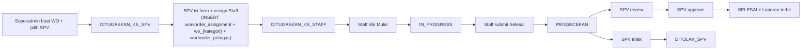

# Plan: ERD Cleanup + Workorder Assignment Table + Flow Update

## 1. Konteks & Keputusan

Sudah dikonfirmasi via tanya-jawab:

- **Penyimpanan waktu assign SPV** → Opsi A: tabel baru `workorder_assignment` (1:1 dengan `workorder`).
- **Scope plan** → update dokumentasi (DBML + Flow) + migration plan + daftar file yang harus di-drop/edit. Eksekusi belakangan.
- **Scope bisnis fokus** → POV SPV saat assign Staff sampai Staff submit "Selesai" (Tahap 5–8). Review/approve/laporan = scope berikutnya.

Flow baru (referensi):



Perbedaan utama vs flow lama di [.cursor/Flow_WO.md](.cursor/Flow_WO.md):
- Hapus Tahap 10 (Manager approve). SPV jadi approver final.
- Drop status `MENUNGGU_APPROVAL_MANAGER` dan `DITOLAK_MANAGER` dari lifecycle aktif.
- Sumber "waktu SPV assign" bukan lagi `workorder_action` atau `workorder_petugas.created_at`, tapi tabel eksplisit `workorder_assignment`.

---

## 2. ERD: Drop + Tambah

### 2.1 Tabel yang di-DROP

File DBML: [.cursor/ERD_Physical.dbml](.cursor/ERD_Physical.dbml) Group 9 (`detail_form`, `detail_progress`, `form_workorder`, `form_template`). Keempatnya sudah ditandai `[DROP]` / `[DROP — BATAL DITAMBAH]` — sekarang dihapus total dari DBML supaya ERD bersih.

| Tabel | Ada di DB? | Aksi |
|---|---|---|
| `form_template` | Tidak (batal) | Hapus blok dari DBML saja |
| `form_workorder` | Ya (migration `2025_03_08_074135`) | Hapus blok DBML + migration drop |
| `detail_form` | Ya (migration `2025_03_08_074202`) | Hapus blok DBML + migration drop |
| `detail_progress` | Ya (migration `2025_04_14_110521`) | Hapus blok DBML + migration drop |

### 2.2 Tabel NEW: `workorder_assignment`

Ditambahkan ke DBML Group 4 (Workorder Core), di bawah `workorder_petugas`:

```dbml
Table workorder_assignment {
  id              bigint       [pk, increment]
  workorder_id    bigint       [not null, unique, ref: - workorder.id, note: '1:1 ke workorder. UNIQUE + NOT NULL. ON DELETE CASCADE.']
  spv_user_id     bigint       [not null, ref: > users.id, note: 'SPV yang melakukan assign (= workorder.assigned_to saat event)']
  assigned_at     timestamp    [not null, note: 'Waktu SPV klik Tugaskan (atomic dengan insert wo_{kategori} + workorder_petugas)']
  catatan_spv     text         [note: 'Catatan opsional SPV untuk tim (mis. instruksi khusus)']
  created_at      timestamp
  updated_at      timestamp

  indexes {
    workorder_id [unique]
    spv_user_id
    assigned_at
  }

  Note: '[NEW] Event assign WO oleh SPV. 1 row per WO (1:1). Diisi di Tahap 5 bersamaan dengan wo_{kategori} + workorder_petugas dalam satu DB transaction.'
}
```

Kenapa tabel terpisah (bukan kolom di `workorder`):
- Semantic clarity — "kapan SPV assign" beda konsep dari `tanggal_mulai` (kapan WO jalan).
- Ruang untuk ekstensi (nanti bisa ditambah `reassigned_from_id` kalau mau support re-assign tanpa breaking change).
- `workorder` row-nya sudah lebar (banyak FK + kolom) — tidak menambah tekanan width.

Keputusan desain yang di-lock:
- 1:1 (bukan histori reassign) untuk MVP. Jika SPV ganti petugas, tetap 1 row — `workorder_action` yang log event ganti. Upgrade ke 1:N = future ticket.
- `assigned_at` redundan dengan `workorder_action` kode `PENUGASAN` untuk SPV → trade-off denormalisasi yang disengaja: query "list WO SPV" jadi tidak perlu JOIN ke audit trail.

---

## 3. Migration Plan

Urutan migration baru (semua idempotent + `down()` lengkap):

1. **`2026_05_04_100000_create_workorder_assignment_table.php`** — buat tabel baru di atas. `down()` drop.
2. **`2026_05_04_100100_drop_legacy_form_tables.php`** — drop `detail_progress` → `detail_form` → `form_workorder` (urutan penting karena FK). `down()` recreate skema persis seperti migration asli (copy dari 3 migration lama).

Migration lama TIDAK dihapus (file `2025_03_08_074135_create_form_workorders_table.php`, `2025_03_08_074202_create_detail_forms_table.php`, `2025_04_14_110521_create_detail_progress_table.php` tetap ada sebagai catatan sejarah migrasi — standar Laravel).

Seeder update:
- [database/seeders/DatabaseSeeder.php](database/seeders/DatabaseSeeder.php) — hapus baris komentar `// $this->call(DetailFormSeeder::class);`.
- [database/seeders/DetailFormSeeder.php](database/seeders/DetailFormSeeder.php) — delete file.
- [database/seeders/StatusSeeder.php](database/seeders/StatusSeeder.php) — (catat, belum dieksekusi di plan ini) untuk flow baru tanpa Manager approval: tetap seed `MENUNGGU_APPROVAL_MANAGER`/`DITOLAK_MANAGER` sebagai status "deprecated" tapi aktif=false, ATAU hapus seed-nya. Tanya user saat eksekusi.

---

## 4. File yang Di-Delete / Di-Edit

### 4.1 Delete (file)

- [app/Models/FormWorkorder.php](app/Models/FormWorkorder.php)
- [app/Models/DetailForm.php](app/Models/DetailForm.php)
- [app/Models/DetailProgress.php](app/Models/DetailProgress.php)
- [app/Http/Controllers/FormWorkorderController.php](app/Http/Controllers/FormWorkorderController.php)
- [app/Http/Controllers/DetailFormController.php](app/Http/Controllers/DetailFormController.php)
- [app/Http/Controllers/DetailProgressController.php](app/Http/Controllers/DetailProgressController.php)
- [database/seeders/DetailFormSeeder.php](database/seeders/DetailFormSeeder.php)

### 4.2 Edit (hapus referensi legacy + tambah relasi `workorderAssignment`)

- [routes/api.php](routes/api.php) — hapus import & route blok `form-workorder` (baris 97–101), `detail-form` (103–107, 110–114), dan `detail-progress` (80). Hapus `use` di atas (baris 4, 5, 14).
- [app/Models/JenisWorkorder.php](app/Models/JenisWorkorder.php) — hapus relasi `formWorkorder()` dan `detailForm()` (baris 18–21, 28–31).
- [app/Models/ProgressWorkorder.php](app/Models/ProgressWorkorder.php) — hapus relasi `detailProgress()` (sekitar baris 20).
- [app/Models/MasterKpi.php](app/Models/MasterKpi.php) — cek & hapus relasi `formWorkorder` kalau ada.
- [app/Models/Workorder.php](app/Models/Workorder.php) — **tambah** relasi `workorderAssignment()` (hasOne) + model baru `WorkorderAssignment.php`.
- [app/Services/ProgressWorkorderService.php](app/Services/ProgressWorkorderService.php) — refactor `createInitialProgress()` (baris 42–81): buang loop `$detailForms` + `DetailProgress::create()`. Flow baru: Staff yang bikin row progress pertama saat klik "Mulai" (lihat Flow_WO Tahap 6).
- [app/Http/Requests/StoreJenisWorkorderRequest.php](app/Http/Requests/StoreJenisWorkorderRequest.php) + [app/Http/Requests/UpdateJenisWorkorderRequest.php](app/Http/Requests/UpdateJenisWorkorderRequest.php) — hapus field `detail_form` kalau ada validasinya.
- [app/Http/Resources/JenisWorkorderResource.php](app/Http/Resources/JenisWorkorderResource.php) — hapus serialization `detail_form`.
- [app/Services/JenisWorkorderService.php](app/Services/JenisWorkorderService.php) — hapus logic create/update `detail_form`.
- [database/factories/JenisWorkorderFactory.php](database/factories/JenisWorkorderFactory.php) — hapus `afterCreating` yang spawn `DetailForm::create()` (baris 38–65).
- [docs/ARCHITECTURE_OVERVIEW.md](docs/ARCHITECTURE_OVERVIEW.md) — update deskripsi (form EAV → form statis per kategori).

### 4.3 NEW (file)

- `app/Models/WorkorderAssignment.php` — Eloquent model dengan `belongsTo(Workorder)` + `belongsTo(User, 'spv_user_id')`.
- `database/migrations/2026_05_04_100000_create_workorder_assignment_table.php` — lihat Section 3.
- `database/migrations/2026_05_04_100100_drop_legacy_form_tables.php` — lihat Section 3.

Catatan: Controller/Service/FormRequest untuk endpoint `POST /v1/workorder/{id}/assign-staff` sudah ada skeleton-nya di [app/Http/Controllers/WorkorderController.php](app/Http/Controllers/WorkorderController.php) (route baris 67) — tapi **body implementation-nya masuk scope ticket berikutnya**, bukan plan ini. Plan ini hanya siapkan storage (tabel) + struktur file + ERD/Flow docs.

---

## 5. Flow_WO.md — Update yang Harus Dilakukan

Edit [.cursor/Flow_WO.md](.cursor/Flow_WO.md):

1. **Section 1, Tahap 5** (SPV Isi Form + Assign Staff) — di blok "Perubahan DB", tambah operasi baru:
   ```
   INSERT workorder_assignment (
       workorder_id, spv_user_id = auth()->id(),
       assigned_at = now(), catatan_spv = ?
   );
   ```
   Dan di Section 3.5 (kode PHP transaction contoh) — tambah step 0 (paling awal): `WorkorderAssignment::create(...)` sebelum insert `wo_{kategori}`.

2. **Section 1, Tahap 9–10** — tandai "SPV approve" sebagai final stage, hapus referensi Manager approve (Tahap 10 lama jadi Tahap 10 baru = SPV approve). Update diagram flow di Section 2:
   - Hapus node `MENUNGGU_APPROVAL_MANAGER` dari jalur sukses.
   - `PENGECEKAN` → `SPV Approve` → `SELESAI` langsung.
   - `DITOLAK_MANAGER` dihapus dari daftar status terminal.

3. **Section 3.7** (tabel "Sisi DB: Apa yang Berubah") — tambah row `workorder_assignment | INSERT | 1` di atas `wo_meter/...`.

4. **Section 4** (Checklist Implementasi) — tambah ticket:
   - `[ ] Migration create_workorder_assignment_table`
   - `[ ] Migration drop_legacy_form_tables`
   - `[ ] Model WorkorderAssignment`
   - `[ ] Update Workorder model — relasi workorderAssignment`

5. **Section 0** (Daftar Aktor) — update baris Manager: peran berubah dari "Approve laporan akhir" → "TIDAK lagi terlibat di flow baru (legacy)". Atau dihapus kalau memang tidak ada lagi peran Manager. **Ini perlu keputusan final** — akan ditanyakan saat eksekusi.

---

## 6. Risiko & Mitigasi

| Risiko | Mitigasi |
|---|---|
| FE Next.js masih hit endpoint `/form-workorder` atau `/detail-form` | Audit consumer sebelum delete route. Kalau masih dipakai, sediakan 410 Gone + deprecation notice dulu 1 sprint sebelum benar-benar hapus. |
| Migration drop gagal karena row masih ada di `detail_progress` / `form_workorder` | Migration `down()` harus bisa restore schema. Urutan drop: `detail_progress` → `detail_form` → `form_workorder` (reverse FK dependency). |
| Factory `JenisWorkorderFactory` dipakai di test yang assume `detail_form` ter-populate | Cek folder `tests/` sebelum edit. Kemungkinan besar belum ada test menyentuh detail_form (capstone project). |
| Hapus Manager approve mengubah response endpoint `POST /workorder/{id}/approve` | [app/Http/Controllers/WorkorderController.php](app/Http/Controllers/WorkorderController.php) punya method `approve`/`reject` yang policy-nya assume Manager. Perlu refactor siapa yang boleh pakai — tapi itu scope lain. |

---

## 7. Yang BELUM di-handle di plan ini (scope berikutnya)

- Implementasi endpoint `POST /v1/workorder/{id}/assign-staff` (Service + FormRequest dispatch per kategori).
- Policy `WorkorderPolicy::assignStaff`.
- Endpoint SPV review/approve (Tahap 9–10 baru).
- Event + Listener `IssueWorkorderReport` saat WO → `SELESAI`.
- Seeder status `DITUGASKAN_KE_STAFF`, dll.
- Cleanup role Manager di auth/policy layer kalau memang benar-benar dicabut.