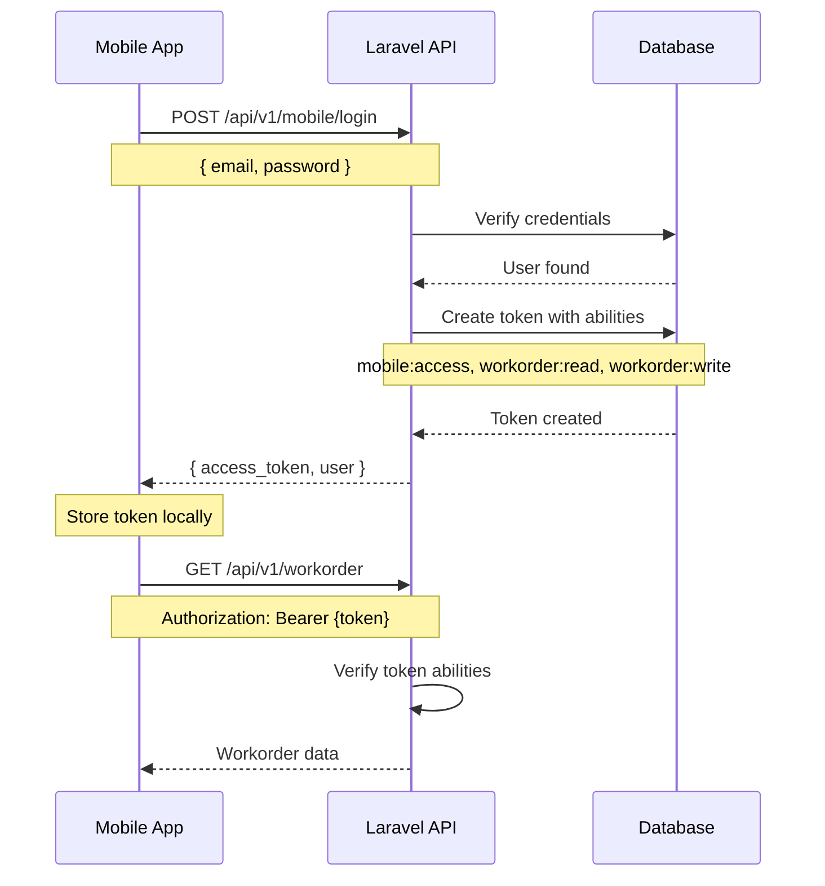

# API Refactoring Documentation - Multi-Client Architecture

**Version:** 1.0  
**Date:** November 1, 2025  
**Status:** ✅ Implemented

---

## 📋 Table of Contents

1. [Overview](#overview)
2. [What Changed](#what-changed)
3. [Architecture](#architecture)
4. [New API Structure](#new-api-structure)
5. [Authentication Flow](#authentication-flow)
6. [Token Abilities](#token-abilities)
7. [Migration Guide](#migration-guide)
8. [Testing Guide](#testing-guide)
9. [Troubleshooting](#troubleshooting)

---

## 🎯 Overview

### Purpose
This refactoring implements a **multi-client API architecture** to support both mobile (Flutter) and web clients with a clean, scalable, and future-proof structure.

### Key Objectives
- ✅ Support multiple client types (Mobile & Web)
- ✅ Implement API versioning from the start
- ✅ Fine-grained access control using token abilities
- ✅ Consistent and predictable URL patterns
- ✅ Maintain backward compatibility where possible

### Benefits
- **Scalable**: Easy to add new client types or API versions
- **Secure**: Client-specific access control via token abilities
- **Maintainable**: Clear separation of concerns
- **Future-proof**: Versioned API structure prevents breaking changes
- **Developer-friendly**: Consistent patterns and clear organization

---

## 🔄 What Changed

### Before Refactoring
```
/api/mobile/login          → Login endpoint (no versioning)
/api/mobile/register       → Register endpoint
/api/workorder             → Shared data endpoints
/api/kpi                   → No clear structure
```

**Problems:**
- ❌ No API versioning
- ❌ Inconsistent URL structure
- ❌ No client differentiation after authentication
- ❌ Limited flexibility for future changes

### After Refactoring
```
/api/v1/mobile/login       → Mobile-specific login
/api/v1/mobile/register    → Mobile-specific register
/api/v1/web/login          → Web-specific login
/api/v1/workorder          → Shared protected resources
/api/v1/kpi                → Versioned and organized
```

**Improvements:**
- ✅ Clear versioning (`/v1/`)
- ✅ Client-specific authentication
- ✅ Token abilities for access control
- ✅ Consistent URL patterns
- ✅ Easy to extend for future needs

---

## 🏗️ Architecture

### High-Level Structure

```
┌─────────────────────────────────────────────────────────────┐
│                     API Entry Point                         │
│                   /api/{version}/...                        │
└─────────────────────────────────────────────────────────────┘
                              │
                ┌─────────────┴─────────────┐
                │                           │
        ┌───────▼───────┐          ┌───────▼───────┐
        │ Mobile Client │          │  Web Client   │
        │   /v1/mobile  │          │   /v1/web     │
        └───────┬───────┘          └───────┬───────┘
                │                           │
                │  Issues tokens with:      │  Issues tokens with:
                │  - mobile:access          │  - web:access
                │  - workorder:read         │  - workorder:read
                │  - workorder:write        │  - workorder:write
                │                           │  - admin:access
                │                           │
                └─────────────┬─────────────┘
                              │
                    ┌─────────▼──────────┐
                    │  Shared Resources  │
                    │   /v1/workorder    │
                    │   /v1/kpi          │
                    │   /v1/pegawai      │
                    │   etc...           │
                    └────────────────────┘
```

### Components

#### 1. **Middleware**
- `EnsureMobileClient` - Validates mobile token abilities
- `EnsureWebClient` - Validates web token abilities

#### 2. **Controllers**
- `AuthController` - Handles client-specific authentication
  - `mobileLogin()`, `mobileRegister()`, `mobileLogout()`
  - `webLogin()`, `webLogout()`
  
#### 3. **Routes** (`routes/api.php`)
- Version-prefixed groups
- Client-specific authentication routes
- Shared protected resources

---

## 🌐 New API Structure

### URL Pattern
```
/api/{version}/{client|resource}/{action}
```

### Complete Endpoint List

#### **Public Endpoints** (No Authentication)

| Method | Endpoint | Description |
|--------|----------|-------------|
| POST | `/api/v1/mobile/login` | Mobile app login |
| POST | `/api/v1/mobile/register` | Mobile app registration |
| POST | `/api/v1/web/login` | Web admin login |
| GET | `/api/ping` | Health check |

#### **Mobile Protected Endpoints** (Requires Mobile Token)

| Method | Endpoint | Description |
|--------|----------|-------------|
| POST | `/api/v1/mobile/logout` | Mobile logout |
| GET | `/api/v1/mobile/me` | Get current mobile user |

#### **Web Protected Endpoints** (Requires Web Token)

| Method | Endpoint | Description |
|--------|----------|-------------|
| POST | `/api/v1/web/logout` | Web logout |
| GET | `/api/v1/web/me` | Get current web user |

#### **Shared Protected Endpoints** (Any Valid Token)

| Resource | Methods | Endpoint |
|----------|---------|----------|
| Workorder | GET, POST, PUT, DELETE | `/api/v1/workorder` |
| Jenis Workorder | GET, POST, PUT, DELETE | `/api/v1/jenis-workorder` |
| Jenis Lokasi | GET, POST, PUT, DELETE | `/api/v1/jenis-lokasi` |
| Progress Workorder | GET, POST, PUT, DELETE | `/api/v1/progress-workorder` |
| Detail Progress | GET, POST, PUT, DELETE | `/api/v1/detail-progress` |
| Lembur SPL | GET, POST, PUT | `/api/v1/lembur-spl` |
| KPI | GET | `/api/v1/kpi` |
| User | GET | `/api/v1/user` |
| Pegawai | GET | `/api/v1/pegawai` |
| Master Location | GET, POST | `/api/v1/master-location` |
| Workorder Action | GET | `/api/v1/workorder-action` |
| Detail Form | GET | `/api/v1/detail-form` |

#### **Utility Endpoints**

| Method | Endpoint | Description |
|--------|----------|-------------|
| POST | `/api/v1/progress-workorder/manual-run` | Manually trigger progress for active workorders |

---

## 🔐 Authentication Flow

### Mobile Client Flow



### Request/Response Examples

#### Login Request
```http
POST /api/v1/mobile/login HTTP/1.1
Host: yourdomain.com
Content-Type: application/json

{
    "email": "user@example.com",
    "password": "password123"
}
```

#### Login Response (Success)
```json
{
    "success": true,
    "message": "Login berhasil",
    "access_token": "1|abcdefghijklmnopqrstuvwxyz1234567890",
    "token_type": "Bearer",
    "user": {
        "id": 1,
        "name": "John Doe",
        "email": "user@example.com",
        "role_id": 2
    }
}
```

#### Authenticated Request
```http
GET /api/v1/workorder HTTP/1.1
Host: yourdomain.com
Authorization: Bearer 1|abcdefghijklmnopqrstuvwxyz1234567890
Accept: application/json
```

---

## 🎫 Token Abilities

### What are Token Abilities?
Token abilities (also called scopes) are permissions attached to each token that determine what resources the token can access.

### Mobile Token Abilities
```php
[
    'mobile:access',      // Can access mobile-specific endpoints
    'workorder:read',     // Can read workorder data
    'workorder:write',    // Can create/update workorders
]
```

### Web Token Abilities
```php
[
    'web:access',         // Can access web-specific endpoints
    'workorder:read',     // Can read workorder data
    'workorder:write',    // Can create/update workorders
    'admin:access',       // Additional admin privileges
]
```

### How It Works

1. **Token Creation**: When a user logs in, a token is created with specific abilities
   ```php
   $token = $user->createToken('mobile-token', [
       'mobile:access',
       'workorder:read',
       'workorder:write',
   ])->plainTextToken;
   ```

2. **Middleware Validation**: Middleware checks if the token has required abilities
   ```php
   // In EnsureMobileClient middleware
   if (!$token->can('mobile:access')) {
       return response()->json(['message' => 'Access denied'], 403);
   }
   ```

3. **Route Protection**: Routes are protected by middleware
   ```php
   Route::middleware(['auth:sanctum', 'client.mobile'])->group(function () {
       // Only mobile tokens can access these routes
   });
   ```

---

## 📦 Migration Guide

### For Existing Mobile App Code

#### ❌ Old Code (Before Refactoring)
```dart
// Old URL structure
const String loginUrl = '/api/mobile/login';
const String workorderUrl = '/api/workorder';
```

#### ✅ New Code (After Refactoring)
```dart
// New versioned URL structure
class ApiConfig {
  static const String baseUrl = 'https://yourdomain.com/api';
  static const String version = 'v1';
  
  // Auth endpoints
  static const String mobileLogin = '$baseUrl/$version/mobile/login';
  static const String mobileRegister = '$baseUrl/$version/mobile/register';
  static const String mobileLogout = '$baseUrl/$version/mobile/logout';
  static const String mobileMe = '$baseUrl/$version/mobile/me';
  
  // Data endpoints
  static const String workorder = '$baseUrl/$version/workorder';
  static const String kpi = '$baseUrl/$version/kpi';
  static const String pegawai = '$baseUrl/$version/pegawai';
}
```

### Migration Checklist

- [ ] Update all API endpoint URLs to include `/v1/` prefix
- [ ] Change `/mobile/login` to `/v1/mobile/login`
- [ ] Change `/mobile/register` to `/v1/mobile/register`
- [ ] Change `/mobile/logout` to `/v1/mobile/logout`
- [ ] Change `/mobile/me` to `/v1/mobile/me`
- [ ] Update data endpoints: `/workorder` → `/v1/workorder`
- [ ] Test all endpoints in development environment
- [ ] Update API documentation
- [ ] Inform team members of changes

### Breaking Changes

⚠️ **Important**: The following URLs have changed:

| Old URL | New URL | Status |
|---------|---------|--------|
| `/api/mobile/login` | `/api/v1/mobile/login` | ✅ Must update |
| `/api/mobile/register` | `/api/v1/mobile/register` | ✅ Must update |
| `/api/mobile/logout` | `/api/v1/mobile/logout` | ✅ Must update |
| `/api/mobile/me` | `/api/v1/mobile/me` | ✅ Must update |
| `/api/workorder` | `/api/v1/workorder` | ✅ Must update |
| `/api/kpi` | `/api/v1/kpi` | ✅ Must update |

---

## 🧪 Testing Guide

### Using Postman

#### 1. Set Up Environment Variables

Create a new environment with:
```
base_url: http://localhost:8000/api
token: (leave empty)
```

#### 2. Test Mobile Login

**Request:**
```
Method: POST
URL: {{base_url}}/v1/mobile/login
Headers:
  Content-Type: application/json
  Accept: application/json

Body (JSON):
{
    "email": "user@example.com",
    "password": "password123"
}
```

**Auto-save Token (Tests tab):**
```javascript
var jsonData = pm.response.json();
if (jsonData.access_token) {
    pm.environment.set("token", jsonData.access_token);
}
```

#### 3. Test Protected Endpoints

**Request:**
```
Method: GET
URL: {{base_url}}/v1/workorder
Headers:
  Authorization: Bearer {{token}}
  Accept: application/json
```

### Testing Checklist

**Public Endpoints:**
- [ ] `GET /api/ping` - Should return health check
- [ ] `POST /api/v1/mobile/login` - Should return token
- [ ] `POST /api/v1/mobile/register` - Should create user and return token
- [ ] `POST /api/v1/web/login` - Should return web token

**Mobile Protected Endpoints:**
- [ ] `GET /api/v1/mobile/me` - Should return user data
- [ ] `POST /api/v1/mobile/logout` - Should invalidate token

**Shared Protected Endpoints:**
- [ ] `GET /api/v1/workorder` - Should return workorders
- [ ] `POST /api/v1/workorder` - Should create workorder
- [ ] `GET /api/v1/kpi` - Should return KPI data
- [ ] `GET /api/v1/pegawai` - Should return employees

**Access Control:**
- [ ] Mobile token can access `/v1/mobile/me`
- [ ] Web token can access `/v1/web/me`
- [ ] Mobile token **cannot** access `/v1/web/me` (should return 403)
- [ ] Web token **cannot** access `/v1/mobile/me` (should return 403)
- [ ] Both tokens can access shared endpoints

### Expected Response Codes

| Code | Meaning | Common Causes |
|------|---------|---------------|
| 200 | Success | Request successful |
| 201 | Created | Resource created successfully |
| 401 | Unauthorized | Missing/invalid token |
| 403 | Forbidden | Token lacks required abilities |
| 404 | Not Found | Endpoint doesn't exist |
| 422 | Validation Error | Invalid request data |
| 500 | Server Error | Internal server error |

---

## 🔧 Troubleshooting

### Common Issues

#### Issue 1: 401 Unauthorized on Protected Routes
**Symptoms:**
```json
{
    "message": "Unauthenticated."
}
```

**Solutions:**
- ✅ Ensure `Authorization` header is present
- ✅ Format: `Bearer {token}` (note the space)
- ✅ Token might be expired or deleted
- ✅ Try logging in again

#### Issue 2: 403 Forbidden (Client Middleware)
**Symptoms:**
```json
{
    "success": false,
    "message": "This endpoint is only accessible to mobile clients."
}
```

**Solutions:**
- ✅ You're using a web token on mobile endpoint (or vice versa)
- ✅ Use the correct login endpoint for your client type
- ✅ Mobile app should use `/v1/mobile/login`
- ✅ Web app should use `/v1/web/login`

#### Issue 3: 404 Not Found
**Symptoms:**
```json
{
    "message": "Route not found"
}
```

**Solutions:**
- ✅ Check URL includes `/v1/` prefix
- ✅ Verify endpoint spelling
- ✅ Ensure Laravel routes are cached: `php artisan route:clear`

#### Issue 4: 422 Validation Error on Register
**Symptoms:**
```json
{
    "success": false,
    "message": "Data tidak valid",
    "errors": {
        "role_id": ["The selected role_id is invalid."]
    }
}
```

**Solutions:**
- ✅ Ensure `role_id` exists in `m_role` table
- ✅ Check all required fields are provided
- ✅ Verify data types match validation rules

#### Issue 5: CORS Errors (Browser/Web)
**Symptoms:**
```
Access to XMLHttpRequest blocked by CORS policy
```

**Solutions:**
- ✅ Check `config/cors.php` settings
- ✅ Ensure `fruitcake/laravel-cors` is installed
- ✅ Verify `allowed_origins` includes your domain
- ✅ Check `supports_credentials` is set appropriately

---

## 📝 Code Reference

### File Structure
```
app/
├── Http/
│   ├── Controllers/
│   │   ├── AuthController.php          ← Authentication logic
│   │   └── ProgressWorkorderController.php
│   ├── Middleware/
│   │   ├── EnsureMobileClient.php      ← Mobile token validation
│   │   └── EnsureWebClient.php         ← Web token validation
│   └── Kernel.php                      ← Middleware registration
routes/
└── api.php                             ← API route definitions
```

### Key Files Modified

1. **`routes/api.php`** - Complete route restructure
2. **`app/Http/Controllers/AuthController.php`** - New auth methods
3. **`app/Http/Kernel.php`** - Middleware registration
4. **`app/Http/Middleware/EnsureMobileClient.php`** - New file
5. **`app/Http/Middleware/EnsureWebClient.php`** - New file
6. **`app/Http/Controllers/ProgressWorkorderController.php`** - Added `manualRun()` method

---

## 🚀 Future Enhancements

### API Versioning Strategy

When breaking changes are needed, create version 2:

```php
// routes/api.php

// Version 1 (existing)
Route::prefix('v1')->group(function () {
    // Current implementation
});

// Version 2 (future)
Route::prefix('v2')->group(function () {
    // New implementation with breaking changes
});
```

### Potential Improvements

1. **Rate Limiting**
   - Different rate limits for mobile vs web
   - Throttle by client type

2. **API Resources**
   - Standardize response formats
   - Transform data before returning

3. **Response Formatting**
   - Consistent success/error response structure
   - Pagination for list endpoints

4. **Logging & Monitoring**
   - Track API usage by client type
   - Monitor token usage patterns

5. **Additional Client Types**
   - Desktop app
   - Third-party integrations
   - Public API access

---

## 👥 Team Guidelines

### For Backend Developers

1. **Adding New Endpoints**
   - Always add under `/v1/` prefix
   - Determine if client-specific or shared
   - Apply appropriate middleware
   - Document in this guide

2. **Modifying Existing Endpoints**
   - Check if change is breaking
   - If breaking, consider creating v2
   - Update tests
   - Notify frontend team

3. **Creating New Client Types**
   - Create new login method in `AuthController`
   - Define token abilities
   - Create client middleware
   - Add routes under `/v1/{client}/`

### For Frontend Developers

1. **Mobile (Flutter)**
   - Use `/v1/mobile/` for auth
   - Store token securely
   - Use `/v1/` for data endpoints
   - Handle 401/403 appropriately

2. **Web (Future)**
   - Use `/v1/web/` for auth
   - Use `/v1/` for data endpoints
   - May have additional admin endpoints

---

## 📞 Support

### Questions?
Contact the backend team or create an issue in the project repository.

### Need Help?
- Check this documentation first
- Review Postman collection
- Test in development environment
- Ask in team chat

---

## 📚 Additional Resources

- [Laravel Sanctum Documentation](https://laravel.com/docs/sanctum)
- [API Resource Pattern](https://laravel.com/docs/eloquent-resources)
- [API Versioning Best Practices](https://www.freecodecamp.org/news/how-to-version-a-rest-api/)
- [RESTful API Design](https://restfulapi.net/)

---

**Last Updated:** November 1, 2025  
**Maintained By:** Backend Development Team  
**Version:** 1.0

